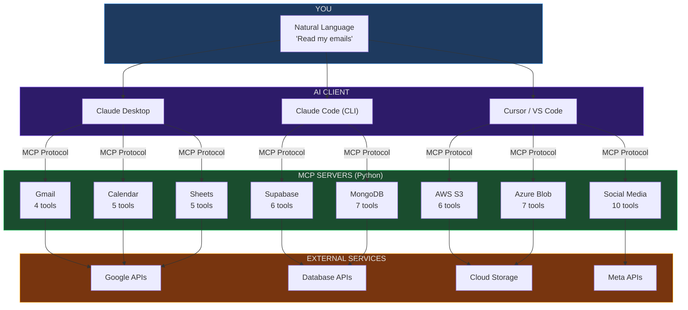
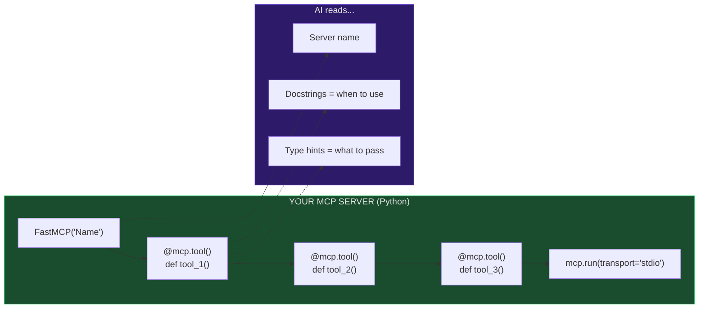
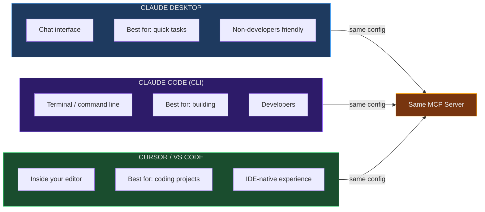
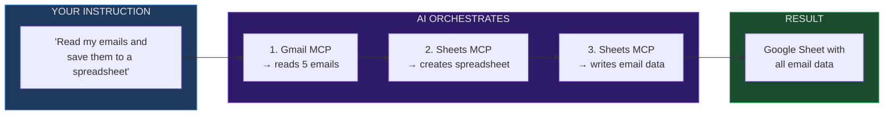
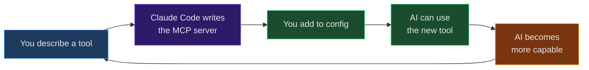

# Claude Code + MCP — Connect AI to Real Tools

> **Euron Live Class | Sprint 1 Day 1**
> By [AIwithDhruv](https://linkedin.com/in/aiwithdhruv)

---

## What is MCP?

**MCP = Model Context Protocol**

Think of it like a **USB port for AI.**

Your phone has a charging port — you can plug in a charger, a data cable, headphones. The port doesn't care what device it is. It just connects.

MCP is the same thing for AI. It's a standard port. Any tool that speaks MCP can plug into any AI that supports MCP.

- Gmail? Plug it in.
- Database? Plug it in.
- Google Sheets? Plug it in.
- Your own custom script? Plug it in.

**One protocol. Infinite tools.**

```
Without MCP:
  You → "Send email" → AI → "Here's how you would send an email..." (just text)

With MCP:
  You → "Send email" → AI → [uses Gmail tool] → Email actually sent!
```

> Without MCP, AI can only **talk**. With MCP, AI can **do**.

---

## How It Works



**8 Servers. 50 Tools. Zero glue code.**

---

## Quick Start (5 minutes)

### Step 1: Install FastMCP

```bash
pip install "mcp[cli]"
```

### Step 2: Create Your First MCP Server

Create a file called `hello_mcp.py`:

```python
from mcp.server.fastmcp import FastMCP

mcp = FastMCP("HelloWorld")

@mcp.tool()
def greet(name: str) -> str:
    """Say hello to someone by name"""
    return f"Hello, {name}! You're connected to MCP!"

@mcp.tool()
def add_numbers(a: int, b: int) -> str:
    """Add two numbers together"""
    return f"{a} + {b} = {a + b}"

@mcp.tool()
def current_time() -> str:
    """Get the current date and time"""
    from datetime import datetime
    return datetime.now().strftime("%Y-%m-%d %H:%M:%S")

mcp.run(transport="stdio")
```

**That's your MCP server.** 3 tools. 20 lines.

### Step 3: Connect It

Find your config file:

| Platform | Config File |
|----------|-------------|
| Claude Desktop (Mac) | `~/Library/Application Support/Claude/claude_desktop_config.json` |
| Claude Desktop (Windows) | `%APPDATA%\Claude\claude_desktop_config.json` |
| Cursor | `.cursor/mcp.json` (in project root) |
| Claude Code | `.claude/settings.local.json` (in project root) |

Add this to the config (replace path with yours):

```json
{
  "mcpServers": {
    "HelloWorld": {
      "command": "python3",
      "args": ["/full/path/to/hello_mcp.py"]
    }
  }
}
```

### Step 4: Test It

Restart Claude Desktop (or reload Cursor). Then chat:

- `"Say hello to Dhruv"` → uses `greet` tool
- `"What time is it?"` → uses `current_time` tool
- `"What is 42 + 58?"` → uses `add_numbers` tool

It works. You just gave AI a new ability.

---

## How an MCP Server Works

Every MCP server follows the same simple pattern:



5 things to know:

| Part | What It Does |
|------|-------------|
| `FastMCP("Name")` | Gives your server a name — AI sees this |
| `@mcp.tool()` | Makes any function available to AI |
| **Type hints** (`str`, `int`) | AI reads these to know what to pass |
| **Docstring** | AI reads this to decide WHEN to use the tool |
| `mcp.run(transport="stdio")` | Connects via standard I/O — no ports, no HTTP |

---

## 3 Ways to Use MCP



**One server. Three clients. Same config format everywhere.**

---

## Level Up: Real Gmail MCP Server

Once your hello world works, connect to actual Gmail.

### 1. Google Cloud Setup (One Time)

1. Go to [console.cloud.google.com](https://console.cloud.google.com)
2. Create a new project
3. Enable **Gmail API** (APIs & Services → Enable APIs)
4. Create **OAuth 2.0 Client ID** (Credentials → Desktop app)
5. Download JSON → save as `credentials.json`

### 2. Install Dependencies

```bash
pip install "mcp[cli]" google-auth google-auth-oauthlib google-api-python-client
```

### 3. Authenticate (One Time)

```python
# authenticate.py
from google_auth_oauthlib.flow import InstalledAppFlow

SCOPES = ["https://www.googleapis.com/auth/gmail.modify"]
flow = InstalledAppFlow.from_client_secrets_file("credentials.json", SCOPES)
creds = flow.run_local_server(port=0)

with open("token.json", "w") as f:
    f.write(creds.to_json())
print("Done! token.json saved.")
```

```bash
python authenticate.py
# Browser opens → sign in → authorize → token.json saved
```

### 4. Create Gmail MCP Server

```python
# gmail_mcp.py
import os, base64
from email.mime.text import MIMEText
from google.oauth2.credentials import Credentials
from google.auth.transport.requests import Request
from googleapiclient.discovery import build
from mcp.server.fastmcp import FastMCP

mcp = FastMCP("Gmail")

def get_service():
    creds = Credentials.from_authorized_user_file("token.json",
        ["https://www.googleapis.com/auth/gmail.modify"])
    if creds.expired:
        creds.refresh(Request())
    return build("gmail", "v1", credentials=creds)

@mcp.tool()
def read_recent_emails(limit: int = 5) -> str:
    """Read recent emails from Gmail inbox"""
    service = get_service()
    results = service.users().messages().list(
        userId="me", maxResults=limit).execute()
    messages = results.get("messages", [])
    output = []
    for msg in messages:
        detail = service.users().messages().get(
            userId="me", id=msg["id"], format="metadata").execute()
        headers = {h["name"]: h["value"]
                   for h in detail["payload"]["headers"]}
        output.append(
            f"From: {headers.get('From', '?')}\n"
            f"Subject: {headers.get('Subject', '?')}\n")
    return "\n---\n".join(output) if output else "No emails found"

@mcp.tool()
def send_email(to_email: str, subject: str, body: str) -> str:
    """Send an email via Gmail"""
    service = get_service()
    message = MIMEText(body)
    message["to"] = to_email
    message["subject"] = subject
    raw = base64.urlsafe_b64encode(message.as_bytes()).decode()
    service.users().messages().send(
        userId="me", body={"raw": raw}).execute()
    return f"Email sent to {to_email}"

mcp.run(transport="stdio")
```

### 5. Add to Config & Test

```json
{
  "mcpServers": {
    "Gmail": {
      "command": "python3",
      "args": ["/full/path/to/gmail_mcp.py"]
    }
  }
}
```

Restart Claude Desktop → `"Read my last 3 emails"` → Real emails appear.

---

## Multi-Server Chaining

The real magic: connect multiple servers and let AI orchestrate.



**One instruction. Three tools. Zero code. AI figures out the chain.**

Config with multiple servers:

```json
{
  "mcpServers": {
    "Gmail": {
      "command": "python3",
      "args": ["/path/to/gmail_mcp.py"]
    },
    "Sheets": {
      "command": "python3",
      "args": ["/path/to/sheets/sheets_mcp.py"]
    },
    "Supabase": {
      "command": "python3",
      "args": ["/path/to/supabase/supabase_mcp.py"],
      "env": {
        "SUPABASE_URL": "https://your-project.supabase.co",
        "SUPABASE_KEY": "your-key"
      }
    }
  }
}
```

> Use `env` for secrets. Never put passwords in code.

---

## All 8 MCP Servers We Built

| # | Server | Tools | Auth | What It Does |
|---|--------|:-----:|------|-------------|
| 1 | **Gmail** | 4 | Google OAuth | Read, send, search, mark emails |
| 2 | **Calendar** | 5 | Google OAuth | Events, schedule, create, delete |
| 3 | **Sheets** | 5 | Google OAuth | Read, write, append, create |
| 4 | **Supabase** | 6 | API Key | Query, insert, update, raw SQL |
| 5 | **MongoDB** | 7 | Connection String | Query, insert, aggregate, count |
| 6 | **AWS S3** | 6 | AWS Credentials | Upload, download, presigned URLs |
| 7 | **Azure Blob** | 7 | Connection String | Upload, download, SAS URLs |
| 8 | **Social Media** | 10 | OAuth + Meta | YouTube, Instagram, Facebook |

**Total: 50 tools** you can give to AI.

Full setup guide: [MAIL-MCP-SETUP.md](../../MAIL-MCP-SETUP.md)

---

## Exercise: Build Your Own

Pick one and build it:

### Option 1: Calculator (Beginner)

```python
from mcp.server.fastmcp import FastMCP

mcp = FastMCP("Calculator")

@mcp.tool()
def add(a: float, b: float) -> str:
    """Add two numbers"""
    return str(a + b)

@mcp.tool()
def multiply(a: float, b: float) -> str:
    """Multiply two numbers"""
    return str(a * b)

@mcp.tool()
def percentage(amount: float, percent: float) -> str:
    """Calculate percentage of a number"""
    return f"{percent}% of {amount} = {amount * percent / 100}"

mcp.run(transport="stdio")
```

### Option 2: File Manager (Intermediate)

```python
import os
from mcp.server.fastmcp import FastMCP

mcp = FastMCP("FileManager")

@mcp.tool()
def list_files(directory: str = ".") -> str:
    """List all files in a directory"""
    files = os.listdir(directory)
    return "\n".join(files) if files else "Empty directory"

@mcp.tool()
def read_file(path: str) -> str:
    """Read contents of a text file"""
    with open(path, "r") as f:
        return f.read()

@mcp.tool()
def file_info(path: str) -> str:
    """Get file size and last modified date"""
    stat = os.stat(path)
    size = stat.st_size
    from datetime import datetime
    modified = datetime.fromtimestamp(stat.st_mtime).strftime("%Y-%m-%d %H:%M")
    return f"Size: {size} bytes | Modified: {modified}"

mcp.run(transport="stdio")
```

### Option 3: Weather (Intermediate)

```python
import requests
from mcp.server.fastmcp import FastMCP

mcp = FastMCP("Weather")

@mcp.tool()
def get_weather(city: str) -> str:
    """Get current weather for any city (free, no API key needed)"""
    # Geocode
    geo = requests.get(
        f"https://geocoding-api.open-meteo.com/v1/search?name={city}&count=1"
    ).json()
    if not geo.get("results"):
        return f"City '{city}' not found"
    lat = geo["results"][0]["latitude"]
    lon = geo["results"][0]["longitude"]
    name = geo["results"][0]["name"]
    country = geo["results"][0].get("country", "")

    # Weather
    weather = requests.get(
        f"https://api.open-meteo.com/v1/forecast?"
        f"latitude={lat}&longitude={lon}&current_weather=true"
    ).json()
    w = weather["current_weather"]
    return (
        f"{name}, {country}\n"
        f"Temperature: {w['temperature']}°C\n"
        f"Wind: {w['windspeed']} km/h\n"
        f"Condition code: {w['weathercode']}"
    )

mcp.run(transport="stdio")
```

### After Building

1. Add it to your config (Claude Desktop / Cursor / Claude Code)
2. Restart and test by chatting
3. Share a screenshot in the WhatsApp group!

---

## Common Issues

| Problem | Fix |
|---------|-----|
| Server not found | Path in config must be **absolute** (not relative) |
| Permission denied | Check `python3` path: run `which python3` |
| Server doesn't show | Restart Claude Desktop completely (quit + reopen) |
| `No module named mcp` | Run `pip install "mcp[cli]"` |
| Google auth fails | Delete `token.json`, re-run `authenticate.py` |
| JSON syntax error | Validate at [jsonlint.com](https://jsonlint.com) |
| Tool not appearing | Check the docstring exists (AI needs it to discover the tool) |

---

## The Self-Building Loop



> AI builds its own tools. You describe what you need, Claude Code writes the MCP server, you plug it in. AI just got a new ability. Repeat.

---

## How This Was Built — The Raw AI Prompts

Everything in this class — the 8 MCP servers, the Claude Desktop setup, the Zoho CRM integration, the Facebook Ads dashboard, even this README — was built using AI. Here are the **exact raw prompts** used, in order.

### Prompt 1: Discovering MCP Was Missing (Feb 23)

After building 28 skills and an Agent Loadout system, I asked Claude Code to check alignment with current standards:

> *"greate just for infromation which types of loadouts we are using and how it aligneds with currnt standarda adn technoly and what are the plan for future updgraders"*

**Result:** Claude identified MCP as a gap — we had skills but no protocol for AI to use them directly.

### Prompt 2: Build the First MCP Server (Feb 23)

This one prompt triggered building the entire MCP infrastructure. I pointed Claude to existing Euron MCP work and told it to implement at the system level:

> *"lets fix all what recommnedd first then we cna work on other ong term whenver needed best apart I alrady added sometihng cool chekc Euron File inside that gen ai 2 and inside that the file that all about mcp alrady did lot of work so you cna chek that and than use your brain to impelent at main level adn we cn use hwenver neecded + add all other other hting tuped skills agen autao loadout tmepalte all step by step I want my system best so we can more focus on makeing money before it kate"*

**Result:** Claude checked the existing 8 Euron MCP servers (50 tools), studied the FastMCP pattern, and built `loadout_mcp.py` — an Agent Loadouts MCP server with 8 new tools. One prompt, one server.

### Prompt 3: Connect to Claude Desktop (Feb 23)

After the server was built, I needed it inside Claude Desktop:

> *"before that what I need to add insdie cladude lareay its dowaloded if you want you can attach direclty or giude me"*

**Result:** Claude generated the exact JSON config for `claude_desktop_config.json`, showed where the file is on Mac, and connected the MCP server. Claude Desktop could now use all 8 tools.

### Prompt 4: Connect Zoho CRM via MCP (Feb 27)

I was tired of downloading CSVs from Zoho Analytics and pasting them. One prompt changed that:

> *"can we integrate using mcp so you can direct access all these things beaczuse even last touch query I am giing you comming same from anayltics"*

Then I confirmed:

> *"yes zoho crm"*

**Result:** Claude built `zoho_crm_mcp.py` — a complete Zoho CRM MCP server with OAuth2 authentication, 7 tools (query leads, count leads, get pipeline, get sales, search by phone). I pasted the OAuth callback URL after authorizing in Zoho:

> *"https://yourapp.com/callback?code=1000.abc123def456..."*

Claude exchanged the code for tokens, saved them to `.env`, and the server was live. Then:

> *"now how this access will be helpful and can you connect and setyp on claude desktop too same"*

**Result:** Added to Claude Desktop config. Now I can ask "How many leads came in this month?" and get real-time CRM data. No CSV exports. No dashboards. Just ask.

### Prompt 5: Connect Facebook Ads via MCP (Feb 28)

Someone in our team's WhatsApp group asked about connecting Claude to Facebook Ads. I asked:

> *"Hey, here we go, just check, submit that message. any idea how we can connect clod with facebook ad i think the same is aksing what you think how we can do"*

Then:

> *"this is good idea. Can you research it? Is this good idea to connect with Claude or is there any other method? Also there that we can connect?"*

**Result:** Claude researched the Meta Marketing API, found no existing MCP server for Facebook Ads, and built `facebook_ads_mcp.py` from scratch — 11 tools including campaign performance, daily/monthly spend, lead forms, audience breakdown, and a dying campaigns alert. I just pasted the Ads Manager URL and access token:

> *"https://adsmanager.facebook.com/adsmanager/manage/campaigns?act=YOUR_AD_ACCOUNT_ID&business_id=YOUR_BUSINESS_ID..."*

> *"EAAXXX..."* (Your Facebook System User access token from Meta Business Manager)

**Result:** Now I can ask "What's our cost per lead this month?" and get real numbers instantly. Built from scratch in one session.

### Prompt 6: Connect n8n via MCP (Feb 28)

n8n has native MCP support. I pasted the config and told Claude to connect:

> *"n8n api key [token]... mcp https://n8n.srv1184808.hstgr.cloud/mcp-server/http [config JSON]... keep this and get n8n skillls also save in .env for nwo and check connection if done by creaeting simple workflow dont autoamtet anyting"*

**Result:** Connected n8n's MCP endpoint via supergateway (streamable HTTP → stdio bridge). Claude can now create, trigger, and manage n8n workflows directly.

### Prompt 7: Prepare This Live Class (Mar 1)

The class you're in right now was prepared with one voice prompt:

> *"Today's evening, we are going to have live class. Claude MCP. Technically, I am going to tell the setup. Inside Claude desktop, along with that, Claude code can be used inside Cursor or VS Code. And there we can do all those setups. They can use MCP locally and then, of course, inside the cloud code they can fix. And we already have an MCP concept in our system that, if you can check, might be already there. You just scan all the files, then check. If it is there, then let me know. If it is not there, we will create one. Or if we can create one inside Euron, give it to public."*

**Result:** Claude scanned the entire workspace — found 13 MCP servers, 80+ tools, 3 setup guides. Then created CLASS-NOTES.md (teaching script), STUDENT-GUIDE.md (student setup), mcp-architecture.excalidraw (architecture diagram), and this README with 5 Mermaid diagrams. All pushed to GitHub in one go.

Then:

> *"can you add one read.me under sprint day mcp folder which is guidng studetnts commnlny also kep all those marmaid digrams too"*

**Result:** This README you're reading right now.

### What Was Built — The Full Timeline

| Date | Raw Prompt (paraphrased) | What AI Built |
|:-----|:------------------------|:-------------|
| Feb 23 | "check Euron MCP files...implement at main level" | **Agent Loadouts MCP Server** (8 tools, FastMCP) |
| Feb 23 | "what I need to add inside Claude Desktop" | **Claude Desktop config** for MCP |
| Feb 24 | "we can add concept of MCP also...to connect with any platform" | **QuotaHit MCP Server** (15 tools + 6 prompts) |
| Feb 27 | "can we integrate using mcp so you can direct access" | **Zoho CRM MCP Server** (7 tools, OAuth2) |
| Feb 27 | "connect and setup on Claude Desktop too" | **Zoho CRM added to Claude Desktop** |
| Feb 28 | "any idea how we can connect Claude with Facebook Ads" | **Facebook Ads MCP Server** (11 tools, Meta API) |
| Feb 28 | "n8n api key...mcp...check connection" | **n8n MCP connection** (via supergateway) |
| Mar 1 | "today's evening...live class...Claude MCP" | **This entire class** (4 files, 5 diagrams) |

**5 custom MCP servers. 80+ tools. 8 days. All built with natural language.**

### What You Can Learn From This

1. **Talk to AI like a human** — typos, voice transcripts, broken grammar. It doesn't matter. AI understands intent.
2. **Point AI to existing work** — "check that file and use your brain to implement" is a valid prompt.
3. **Build incrementally** — First hello world, then Gmail, then CRM, then Ads. Each one took minutes.
4. **Paste credentials, not instructions** — Give AI the callback URL, the token, the account ID. Let it figure out the rest.
5. **One prompt = one server** — You don't need to plan. Describe what you want, AI builds the MCP server, plug it in.
6. **AI builds its own tools** — The self-building loop is real. AI wrote the MCP servers that made AI more capable.

---

## What's In This Folder

| File | Who It's For | What It Is |
|------|-------------|-----------|
| **README.md** | Students | This guide — setup, diagrams, exercises |
| [STUDENT-GUIDE.md](STUDENT-GUIDE.md) | Students | Detailed step-by-step with Gmail server |
| [CLASS-NOTES.md](CLASS-NOTES.md) | Instructor | Live class script (5-Act structure) |
| [mcp-architecture.excalidraw](mcp-architecture.excalidraw) | Both | Architecture diagram (import at excalidraw.com) |

---

## Resources

| Resource | Link |
|----------|------|
| MCP Official Docs | [modelcontextprotocol.io](https://modelcontextprotocol.io) |
| FastMCP Library | [github.com/jlowin/fastmcp](https://github.com/jlowin/fastmcp) |
| Claude Desktop | [claude.ai](https://claude.ai) |
| Claude Code | `npm install -g @anthropic-ai/claude-code` |
| Cursor IDE | [cursor.com](https://cursor.com) |
| Our 8 MCP Servers | [Gen-AI-2.O/MCP/](../../Gen-AI-2.O/MCP/) |
| Full Setup Guide | [MAIL-MCP-SETUP.md](../../MAIL-MCP-SETUP.md) |

---

## Next Session (Day 2)

- Deploy MCP servers to the cloud
- Triggers and webhooks — automation that runs 24/7
- Error handling and retry logic
- GitHub → production pipeline

---

<div align="center">

**Built for [Euron](https://euron.one) Live Classes by [AIwithDhruv](https://linkedin.com/in/aiwithdhruv)**

Applied AI Engineer & Solutions Architect

</div>
